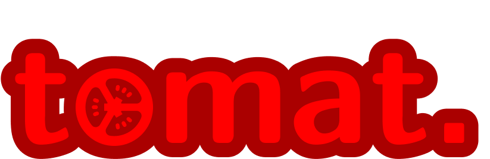

<div align="center">
  
</div>

<div align="center">
  
</div>

"tomat" is an open source pomodro application that lives in your menu bar. When activated it will run the following schedule:

- 3x 25 min. focus, 5 min. break
- 25 min. focus
- 15 min. break

Also it is able to toggle your notifications on and off when it is in the "focus" phase. It was built with macOS in mind but should in theory work for Windows and GNU/Linux as well, but you will have to package it yourself :man_shrugging:


<div align="center">
  
</div>


## Installation

Download the packaged `dmg` right [mother fricking here]().

## Develop

So you want to change things up or play around with it yourself, huh? Well okay then, here are some pointers.

#### Install 

```
yarn or npm install
```

#### Run that :shit:
```
yarn start or npm run start
```

#### Package it up 📦
```
yarn package or npm run package
```

## Icons

The tomato icon used through the app is created by [Arthur Slain](https://thenounproject.com/ArtZ91/) :tada:

## Notes

The packaged app is called "Tomat" and not "tomat", this is to conform with what seems to be the standard of macOS' naming scheme.
